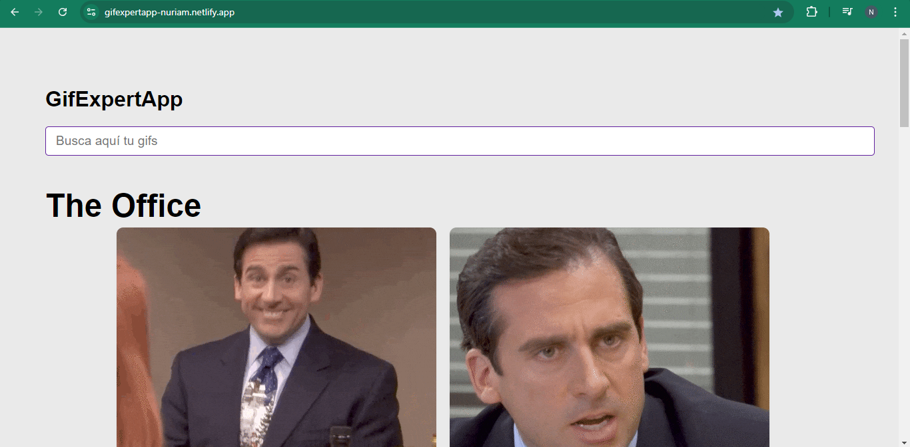

<!--
*** Thanks for checking out the GIF EXPERT APP. If you have a suggestion
*** that would make this better, please fork the repo and create a pull request
*** or simply open an issue with the tag "enhancement".
*** Don't forget to give the project a star!
*** Thanks again! Now go create something AMAZING! :D
-->

<!-- PROJECT SHIELDS -->
<!--
*** I'm using markdown "reference style" links for readability.
*** Reference links are enclosed in brackets [ ] instead of parentheses ( ).
*** See the bottom of this document for the declaration of the reference variables
*** for contributors-url, forks-url, etc. This is an optional, concise syntax you may use.
*** https://www.markdownguide.org/basic-syntax/#reference-style-links
-->

[![LinkedIn][linkedin-shield]][linkedin-url]

<!-- PROJECT LOGO -->
<br />
<div align="center">
  <a href="https://github.com/nurieemm16/GifExpertApp.git">
    
  </a>

  <h3 align="center">Gif Expert App</h3>

  <p align="center">
  Gif Expert App is the ultimate destination for finding GIFs of what you need! Whether you're a fan of pop culture, sports, memes, or cute animals, our easy-to-use platform allows you to discover and share the perfect GIF for any moment. Simply search for what you love, and browse through an extensive collection of animated GIFs that capture the essence of your favorite topics. Start exploring now and express yourself with the best GIFs on the internet!
    <br />
    <a href="#"><strong>Explore the docs »</strong></a>
    <br />
    <br />
    <a href="https://github.com/nurieemm16/GifExpertApp/issues">Report Bug</a>
    ·
    <a href="https://github.com/nurieemm16/GifExpertApp/issues">Request Feature</a>
  </p>
</div>

<!-- TABLE OF CONTENTS -->
<details>
  <summary>Table of Contents</summary>
  <ol>
    <li>
      <a href="#about-the-project">About The Project</a>
      <ul>
        <li><a href="#built-with">Built With</a></li>
      </ul>
    </li>
    <li>
      <a href="#getting-started">Getting Started</a>
      <ul>
        <li><a href="#installation">Installation</a></li>
      </ul>
    </li>
    <li><a href="#roadmap">Roadmap</a></li>
    <li><a href="#contact">Contact</a></li>
    <li><a href="#acknowledgments">Acknowledgments</a></li>
  </ol>
</details>

<!-- ABOUT THE PROJECT -->

## About The Project



Gif Expert App is the ultimate destination for finding GIFs of what you need! Whether you're a fan of pop culture, sports, memes, or cute animals, our easy-to-use platform allows you to discover and share the perfect GIF for any moment. Simply search for what you love, and browse through an extensive collection of animated GIFs that capture the essence of your favorite topics. Start exploring now and express yourself with the best GIFs on the internet!

Objectives:

- Enable Easy GIF Discovery: Provide users with a simple and efficient way to search for and find GIFs related to their favorite topics.
- Build a Comprehensive GIF Library: Curate a wide and diverse collection of GIFs that cater to various interests and trends.

Benefits:

- User-Friendly Interface: The intuitive design ensures a seamless browsing experience for users of all ages.
- Wide Variety of Content: A vast collection of GIFs covers everything from trending topics to niche interests, satisfying a broad audience.

<p align="right">(<a href="#readme-top">back to top</a>)</p>

### Built With

[![React][React.js]][React-url]

<p align="right">(<a href="#readme-top">back to top</a>)</p>

<!-- GETTING STARTED -->

## Getting Started

### Installation

1. Clone the repo
   ```sh
   git clone https://github.com/your_username_/Project-Name.git
   ```
2. Install NPM packages
   ```sh
   npm install
   ```
3. Run the project
   ```sh
   npm start
   ```

<p align="right">(<a href="#readme-top">back to top</a>)</p>

<!-- ROADMAP -->

## Roadmap

- [x] Fix gif bug
- [ ] Add deployed API
- [ ] Deploy

See the [open issues](https://github.com/nurieemm16/GifExpertApp/issues) for a full list of proposed features (and known issues).

<p align="right">(<a href="#readme-top">back to top</a>)</p>

<!-- CONTACT -->

## Contact

Núria Marzo - [Linkedin](www.linkedin.com/in/núria-marzo)

Project Link: [Github](https://github.com/nurieemm16/GifExpertApp.git)

<p align="right">(<a href="#readme-top">back to top</a>)</p>

<!-- ACKNOWLEDGMENTS -->

## Acknowledgments

- [Img Shields](https://shields.io)

<p align="right">(<a href="#readme-top">back to top</a>)</p>

<!-- MARKDOWN LINKS & IMAGES -->
<!-- https://www.markdownguide.org/basic-syntax/#reference-style-links -->

[linkedin-shield]: https://img.shields.io/badge/-LinkedIn-black.svg?style=for-the-badge&logo=linkedin&colorB=555
[linkedin-url]: http://www.linkedin.com/in/núria-marzo
[React.js]: https://img.shields.io/badge/React-20232A?style=for-the-badge&logo=react&logoColor=61DAFB
[React-url]: https://reactjs.org/
